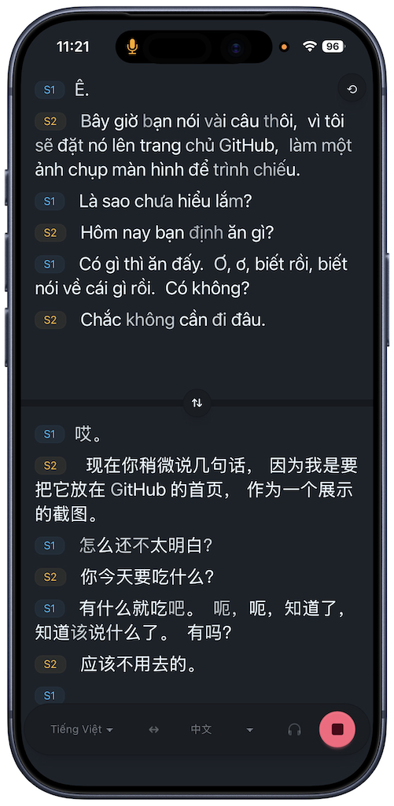

# Translate

Realtime two-way interpreter for a device laid flat between two speakers. Pick any pair from different languages. Wraps Soniox real-time translation over WebSocket; speakers are distinguished via diarization.



## How it works

Single Soniox WebSocket session in two-way translation mode (`language_a` / `language_b` set from the two selectors) with speaker diarization enabled. Mic audio is captured via Web Audio API and downsampled to 16 kHz s16le by an `AudioWorklet`, then pushed as binary frames over the socket.

Tokens stream back tagged with `language`,         `speaker`,         `is_final`, and `translation_status`. Each token is routed to the pane matching its language — the screen is split top (A) / bottom (B), so each utterance appears as the original in one pane and the translation in the other. Within each pane, lines are grouped by speaker and color-coded.

## Interactions

* **Tap a sentence** — selects it and its translation as a pair. Tap the selected sentence again to hear it spoken aloud (TTS). Tap delete button to delete the pair. 
* **Earphone mode** — toggle for when each speaker wears one earbud: translations are read aloud automatically as they arrive, each language panned to its own side, and the mic keeps listening even while TTS plays. (Side splitting doesn't work on iOS due to a system limitation.)

## Run

```
# .env
VITE_SONIOX_API_KEY=...
```

```bash
# build
make build

# local dev
make serve
```

## Docker

The Soniox key is inlined into the bundle at build time, so it must be passed as a build arg:

```bash
docker build --build-arg VITE_SONIOX_API_KEY=... -t translate .
docker run -p 4173:4173 translate
```

App is served at `http://localhost:4173/translate/`.
